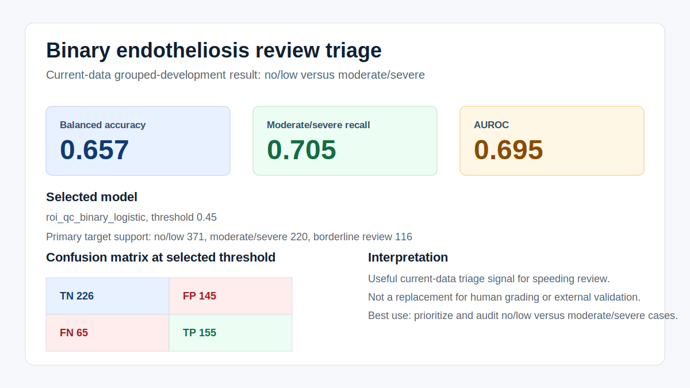
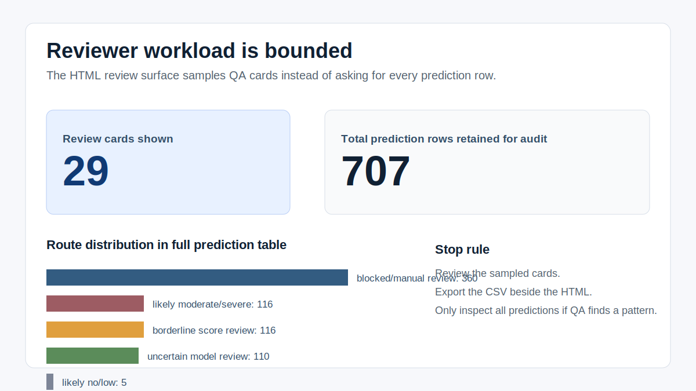

# Endotheliosis Quantifier

Endotheliosis Quantifier (`eq`) is a research pipeline for glomeruli segmentation and image-level endotheliosis review triage in kidney histology.

The current usable endpoint is a binary review-triage workflow:

- `no_low`: score `0` or `0.5`
- `moderate_severe`: score `1.5`, `2`, or `3`
- `borderline_review`: score `1.0`, routed for review

The model is useful for prioritizing human review of no/low versus moderate/severe cases. It is not a clinical diagnostic device, an autonomous grader, or external validation evidence.

| Current performance summary | Review workload summary |
| --- | --- |
|  |  |

## Quick Start

Install the package in the environment that matches the machine.

Linux/CUDA:

```bash
mamba env create -f environment.yml
conda activate eq
pip install -e .[dev]
```

macOS Apple Silicon/MPS:

```bash
mamba env create -f environment-macos.yml
conda activate eq-mac
pip install -e .[dev]
```

Check that the CLI imports:

```bash
python -m eq --help
eq capabilities
eq mode --show
```

## Start A Label Studio Grading Project

Use this when collaborators need to grade complete glomeruli from a directory of images. Docker Desktop is required because Label Studio runs as a separate local web app, not inside the `eq-mac` environment.

macOS setup:

```bash
brew install --cask docker
open -a Docker
```

Wait for Docker Desktop to finish starting, then run:

```bash
conda activate eq-mac
eq labelstudio start --images /path/to/images
```

The command recursively imports `.jpg`, `.jpeg`, `.png`, `.tif`, and `.tiff` files, creates a local Label Studio project with `configs/label_studio_glomerulus_grading.xml`, and prints the Label Studio URL plus project URL.

Default local login:

```text
Email: eq-admin@example.local
Password: eq-labelstudio
```

Preview without starting Docker or importing tasks:

```bash
eq labelstudio start --images /path/to/images --dry-run
```

For details, see [docs/LABEL_STUDIO_GLOMERULUS_GRADING.md](docs/LABEL_STUDIO_GLOMERULUS_GRADING.md).

## Run The Current Quantification Workflow

The main entrypoint is YAML-first:

```bash
eq run-config --config configs/endotheliosis_quantification.yaml
eq run-config --config configs/label_free_roi_embedding_atlas.yaml
```

The first command builds the scored ROI, embedding, burden, comparator, learned-ROI, and review artifact tree. The second command builds the label-free ROI embedding atlas and the binary no/low versus moderate/severe triage handoff.

The committed configs expect the runtime root to contain the required data, masks, labels, and model artifacts. Use `EQ_RUNTIME_ROOT` or edit the YAML when running against a different runtime tree.

## Review The Result

Open the atlas output in this order:

1. `burden_model/embedding_atlas/INDEX.md`
2. `burden_model/embedding_atlas/summary/atlas_verdict.json`
3. `burden_model/embedding_atlas/evidence/embedding_atlas_review.html`
4. `burden_model/embedding_atlas/binary_review_triage/INDEX.md`
5. `burden_model/embedding_atlas/binary_review_triage/evidence/binary_triage_review.html`

The binary review HTML is a bounded QA sample, not a request to review every prediction row. Review the cards shown, export the CSV beside the HTML file, and inspect the full prediction table only if the sample reveals a systematic failure pattern.

## Current Result

Current selected triage model:

```text
roi_qc_binary_logistic
```

Current grouped-development metrics:

| Metric | Value |
| --- | ---: |
| Balanced accuracy | 0.657 |
| Moderate/severe recall | 0.705 |
| Precision | 0.517 |
| Specificity | 0.609 |
| AUROC | 0.695 |
| Average precision | 0.538 |

Target support:

| Group | Count |
| --- | ---: |
| no/low | 371 |
| moderate/severe | 220 |
| borderline review | 116 |

For the full checkpoint and release policy, see [docs/REPRODUCIBILITY_HANDOFF_2026-04-30.md](docs/REPRODUCIBILITY_HANDOFF_2026-04-30.md).

## Other Maintained Workflows

All maintained workflows use the same `eq run-config` entrypoint.

| Task | Config |
| --- | --- |
| Glomeruli candidate comparison | `configs/glomeruli_candidate_comparison.yaml` |
| Mitochondria pretraining | `configs/mito_pretraining_config.yaml` |
| Glomeruli fine-tuning | `configs/glomeruli_finetuning_config.yaml` |
| Glomeruli transport audit | `configs/glomeruli_transport_audit.yaml` |
| High-resolution concordance | `configs/highres_glomeruli_concordance.yaml` |
| Endotheliosis quantification | `configs/endotheliosis_quantification.yaml` |
| Label-free atlas and binary triage | `configs/label_free_roi_embedding_atlas.yaml` |

Use `--dry-run` before long-running training or audit jobs:

```bash
eq run-config --config configs/glomeruli_candidate_comparison.yaml --dry-run
```

## Repository Layout

```text
configs/      Runnable workflow YAMLs
docs/         Supporting guides, methods notes, and handoff docs
openspec/     Spec-driven change history and current contracts
src/eq/       Python package and CLI implementation
tests/        Unit and integration tests
assets/       Public-safe images for README/docs
```

Large data, trained models, logs, generated reports, notebooks, and review exports stay out of Git. Runtime paths are configured through `EQ_RUNTIME_ROOT`, `analysis_registry.yaml`, and `src/eq/utils/paths.py`.

## Documentation Map

- [docs/BINARY_REVIEW_TRIAGE_GUIDE.md](docs/BINARY_REVIEW_TRIAGE_GUIDE.md): how to review the binary triage HTML and interpret its dropdowns.
- [docs/REPRODUCIBILITY_HANDOFF_2026-04-30.md](docs/REPRODUCIBILITY_HANDOFF_2026-04-30.md): source checkpoint, metrics, release policy, and resume plan.
- [docs/ONBOARDING_GUIDE.md](docs/ONBOARDING_GUIDE.md): longer walkthrough for collaborators and future-you.
- [docs/OUTPUT_STRUCTURE.md](docs/OUTPUT_STRUCTURE.md): runtime directory layout and artifact locations.
- [docs/SEGMENTATION_ENGINEERING_GUIDE.md](docs/SEGMENTATION_ENGINEERING_GUIDE.md): segmentation engineering details.
- [docs/TECHNICAL_LAB_NOTEBOOK.md](docs/TECHNICAL_LAB_NOTEBOOK.md): detailed lab notes and current internal evidence.
- [docs/HISTORICAL_NOTES.md](docs/HISTORICAL_NOTES.md): archived implementation history.

## Development Checks

Run before committing:

```bash
ruff check .
python -m pytest -q
openspec validate --specs --strict
```
