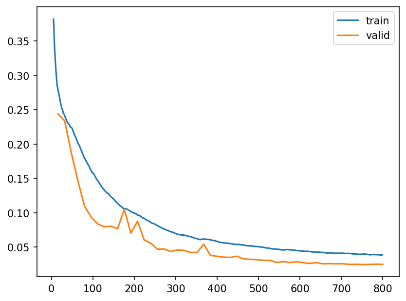
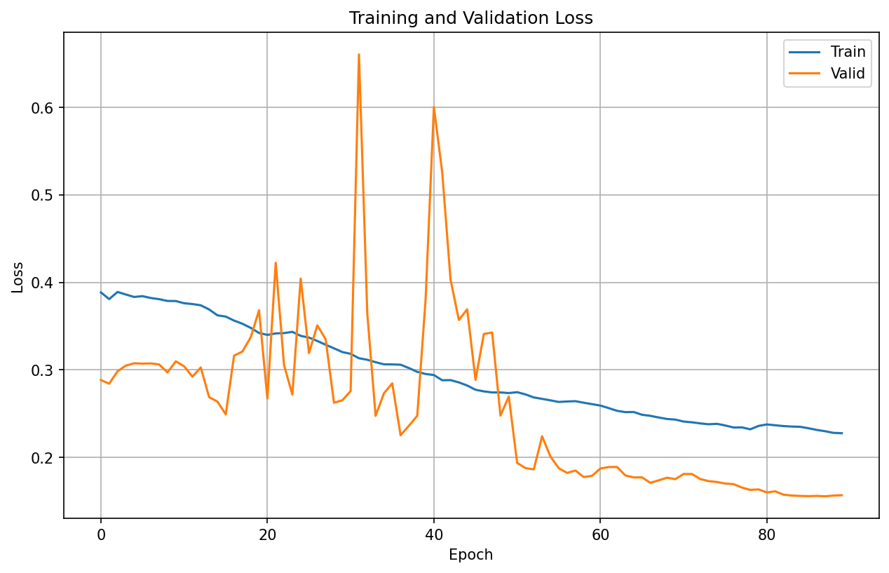
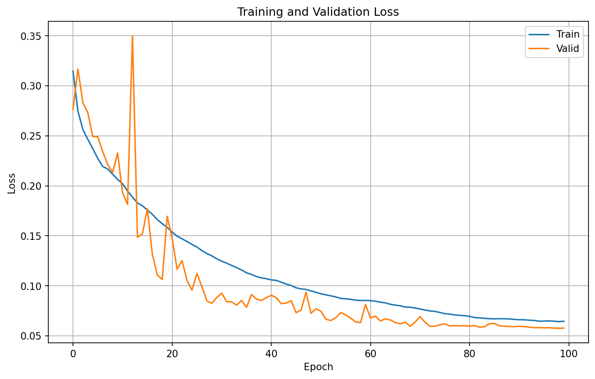

# Endotheliosis Quantifier (EQ)

A deep learning pipeline for automated quantification of endotheliosis severity in (mouse) glomeruli histology images. The system uses a two-stage approach: first training a mitochondria segmentation model on a public electron microscopy data to learn substructure and line features, then transferring this knowledge to segment glomeruli in light microscopy images for endotheliosis quantification.

**Key Features:**
- **Two-stage training**: Mitochondria pretraining → glomeruli transfer learning
- **Dynamic Image Patching**: Modern approach with full image augmentation and on-the-fly cropping (default for all methods, no need to resize inputs)
- **ROI identification**: Automated segmentation of glomeruli regions

**Planned:**
- **Regression modeling**: Predicts endotheliosis severity scores (0-3 scale)
- **Quantitative analysis**: Objective assessment of endotheliosis in preclinical models

## Installation

```bash
# Clone the repository
git clone https://github.com/nicholas-camarda/endotheliosis_quantifier.git
cd endotheliosis_quantifier

# Create and activate conda environment (use mamba)
mamba env create -f environment.yml
mamba activate eq

# Install in development mode (enables CLI `eq`)
pip install -e .[dev]

# Create standard directories
mkdir -p data/raw_data data/derived_data models/segmentation/{mitochondria,glomeruli} test_output

# Download Lucchi mitochondria dataset
# For more information about the dataset, see: https://www.epfl.ch/labs/cvlab/data/data-em/
cd data/raw_data
wget -O ./lucchi.zip http://rhoana.rc.fas.harvard.edu/dataset/lucchi.zip
unzip -o ./lucchi.zip
cd ../..
```

---
## Training Workflow

### Organize Imaging Datas

#### Data Requirements

- **Mitochondria Data**: Electron microscopy images with mitochondria annotations (Lucchi dataset)
- **Glomeruli Data**: H&E stained kidney histology images with glomeruli binary annotations
- **Subject Metadata**: Excel file with glomeruli scoring matrix (`subject_metadata.xlsx`)
  - **Why a matrix?**: Multiple images were taken per mouse, and each image was scored individually
  - **Format**: Glomeruli numbers (rows) × Individual images (columns)
  - **Score values**: 0 (normal), 0.5 (mild), 1 (moderate), 2 (severe)

**Example structure:**
| Glomerulus # | T19-1 | T19-2 | T30-1 | T30-2 | T30-3 |
|--------------|-------|-------|-------|-------|-------|
| 1            | 0.5   | 1     | 0     | 0.5   | 0     |
| 2            | 0     | 1     | 0.5   | 0     | 0     |
| 3            | 0     | 0.5   | 1     | 0     | 0     |
| 4            | 0.5   | 0.5   | 0     | 0     | 0     |

**Naming Convention**: `{SUBJECT_ID}-{IMAGE_NUMBER}`
- **Subject ID**: Any identifier (e.g., `T19`, `Mouse_A`, `Patient_001`, `Control_1`, etc.)
- **Image Number**: `1`, `2`, `3`, etc. (sequential images from the same subject)
- **Examples**: 
  - `T19-1` = Subject T19, Image 1 (first image from subject T19)
  - `T19-2` = Subject T19, Image 2 (second image from subject T19)
  - `Mouse_A-1` = Subject Mouse_A, Image 1 (first image from subject Mouse_A)
  - `Patient_001-1` = Subject Patient_001, Image 1 (first image from subject Patient_001)
  - `Control_1-2` = Subject Control_1, Image 2 (second image from subject Control_1)
- **Supported Formats**: TIF, PNG, JPEG for images; PNG for masks
- **Mask Values**: Binary masks with 0 (background) and 255 (foreground) values

#### Creating Masks from Label Studio Annotations

**Export masks directly as PNG images from Label Studio:**

##### Step 1: Set up Label Studio (if you don't have it)

```bash
# Open a new terminal and create Label Studio environment
conda create -n label-studio python=3.9
conda activate label-studio

# Install Label Studio
pip install label-studio

# Start Label Studio
label-studio start
```

**Follow the [Label Studio Quick Start Guide](https://labelstud.io/guide/quick_start) to:**
1. Create a Label Studio account
2. Set up your first project
3. Configure segmentation tasks for glomeruli annotation (use a template for semantic segmentation --> masks)
4. Import your H&E images
5. Draw segmentation masks on your glomeruli

##### Step 2: Export masks as PNG images

**In Label Studio:**
1. Go to your project
2. Click **"Export"** button
3. Select **"Brush labels to PNG"** format
4. Click **"Export"** to download the masks

**This will create:**
- One PNG file per image with your segmentation masks
- Binary masks (0=background, 255=glomerulus)
- Same filename as original images with `_mask` suffix

##### Step 3: Organize your data structure

**Place the exported PNG masks in your project directory:**
```
data/raw_data/your_project/
├── images/                    # Original H&E images
│   ├── T19/
│   │   └── T19_Image0.jpg
│   └── T30/
│       └── T30_Image0.jpg
├── masks/                     # Exported PNG masks from Label Studio
│   ├── T19/
│   │   └── T19_Image0_mask.png
│   └── T30/
│       └── T30_Image0_mask.png
└── subject_metadata.xlsx      # Endotheliosis severity scores (0-3)
```

**Note:** The PNG export from Label Studio creates binary masks automatically, so no additional processing is needed.

#### Expected Raw Imaging Data Structure

After installation, your `data/raw_data/` directory should be organized as follows:

```
data/raw_data/
├── mnt/coxfs01/vcg_connectomics/mitochondria/Lucchi/    # Mitochondria dataset (from Lucchi et al. 2012)
│   ├── img/                                          # EM images
│   └── label/                                           # Mitochondria annotations
└── your_project_name/                                   # Your glomeruli data
    ├── images/                                          # H&E stained mouse glomeruli images
    ├── masks/                                           # Glomeruli annotations (optional)
    └── annotations/                                     # Label Studio JSON export (optional)
        └── annotations.json
```

---

### Check Hardware Capabilities

Now that you have your annotations converted to masks, you're ready to start the training pipeline. First, let's check your system capabilities and set the appropriate mode:

```bash
# Ensure you have activated environment
mamba activate eq

# Check hardware capabilities and get recommendations
eq capabilities

# Show current mode and suggestions
eq mode --show
```

---

### Image Processing and Segmentation Pipeline

This repository provides tools to train segmentation models from scratch. The complete pipeline trains mitochondria models first, then uses transfer learning for glomeruli segmentation.

**Note**: Pre-trained models will be available in future releases for inference-only use cases.

#### Validate Naming Conventions

```bash
# Check if your image files follow the correct naming convention
eq validate-naming --data-dir data/raw_data/your_project

# Use --strict flag to exit with error code if invalid files are found
eq validate-naming --data-dir data/raw_data/your_project --strict
```

This command will:
- ✅ Validate all image filenames against the expected naming convention
- ❌ Report invalid filenames with specific error messages
- ⚠️  Warn about mixed naming conventions (new vs legacy format)
- 📊 Provide summary statistics of valid/invalid files


#### Data Processing with Dynamic Patching

The system uses **dynamic patching** - a modern approach that processes full images on-the-fly during training. This provides better augmentation diversity and preserves full image context.

**For Glomeruli Data (H&E images):**
```bash
# Use full images directly - no preprocessing required!
# The system will apply augmentations to full images, then extract random 256×256 crops during training

# Your data structure should be:
# data/raw_data/your_project/
#   ├── images/                    # Full H&E images (any size)
#   │   ├── T19/                   # Subject T19
#   │   │   ├── T19-1.jpg          # First image from subject T19
#   │   │   ├── T19-2.jpg          # Second image from subject T19
#   │   │   └── T19-3.jpg          # Third image from subject T19
#   │   ├── Mouse_A/               # Subject Mouse_A
#   │   │   ├── Mouse_A-1.jpg      # First image from subject Mouse_A
#   │   │   └── Mouse_A-2.jpg      # Second image from subject Mouse_A
#   │   └── Patient_001/           # Subject Patient_001
#   │       └── Patient_001-1.jpg  # First image from subject Patient_001
#   └── masks/                     # Full masks (same size as images)
#       ├── T19/                   # Subject T19 masks
#       │   ├── T19-1_mask.png     # Mask for T19-1.jpg
#       │   ├── T19-2_mask.png     # Mask for T19-2.jpg
#       │   └── T19-3_mask.png     # Mask for T19-3.jpg
#       ├── Mouse_A/               # Subject Mouse_A masks
#       │   ├── Mouse_A-1_mask.png # Mask for Mouse_A-1.jpg
#       │   └── Mouse_A-2_mask.png # Mask for Mouse_A-2.jpg
#       └── Patient_001/           # Subject Patient_001 masks
#           └── Patient_001-1_mask.png # Mask for Patient_001-1.jpg
```

**Benefits of Dynamic Patching:**
- **Better Augmentation**: Augmentations applied to full images before cropping provide more diverse training samples
- **Context Preservation**: Full image context is available during augmentation

```bash
# 2) Train mitochondria segmentation model
# Note: Mitochondria data needs two-step preprocessing due to large TIF files

# Step 2a: Extract large images from TIF files (no patchifying)
RAW_MITO_DIR=data/raw_data/mnt/coxfs01/vcg_connectomics/mitochondria/Lucchi
eq extract-images \
  --input-dir "$RAW_MITO_DIR" \
  --output-dir data/derived_data/mito

# Step 2b: Train with dynamic patching using extracted large images
python -m eq.training.train_mitochondria \
  --data-dir data/derived_data/mito \
  --model-dir models/segmentation/mitochondria \
  --epochs 50 \
  --batch-size 16 \
  --learning-rate 1e-3 \
  --image-size 256 \
  --use-dynamic-patching

# Expected output example:
# models/segmentation/mitochondria/
#   └── mitochondria_model/
#       ├── mitochondria_model-pretrain_e50_b16_lr1e-3_sz256.pkl
#       ├── training_loss.png
#       ├── validation_predictions.png
#       └── training_history.tsv

# 3) Train glomeruli model using dynamic patching (recommended approach)

# Option A: Two-stage transfer learning from mitochondria (recommended)
# The system will auto-detect the best mitochondria model automatically
# Crop size 512 to reflect the fact that glomeruli are larger, then resize down to 256 for backbone compatibility
python -m eq.training.train_glomeruli \
  --data-dir data/raw_data/preeclampsia_project \
  --model-dir models/segmentation/glomeruli \
  --epochs 50 \
  --batch-size 16 \
  --learning-rate 1e-3 \
  --loss bcedice \
  --image-size 256 \
  --crop-size 512 \
  --use-dynamic-patching


# Option B: Train from scratch (no transfer learning)
python -m eq.training.train_glomeruli \
  --data-dir data/raw_data/preeclampsia_project \
  --model-dir models/segmentation/glomeruli \
  --epochs 50 \
  --batch-size 16 \
  --learning-rate 1e-3 \
  --loss dice \
  --image-size 256 \
  --crop-size 512 \
  --use-dynamic-patching \
  --from-scratch


# Expected output example:
# models/segmentation/glomeruli/
#   ├── transfer/                    # Transfer learning approach
#   │   └── glomeruli_model-transfer_loss-dice_s1lr1e-03_s2lr_lrfind_e50_b16_lr1e-3_sz256/
#   │       ├── glomeruli_model-transfer_loss-dice_s1lr1e-03_s2lr_lrfind_e50_b16_lr1e-3_sz256.pkl
#   │       ├── glomeruli_model-transfer_loss-dice_s1lr1e-03_s2lr_lrfind_e50_b16_lr1e-3_sz256_lr_finder.png   # if lr_find used
#   │       ├── glomeruli_model-transfer_loss-dice_s1lr1e-03_s2lr_lrfind_e50_b16_lr1e-3_sz256_metrics.png
#   │       ├── glomeruli_model-transfer_loss-dice_s1lr1e-03_s2lr_lrfind_e50_b16_lr1e-3_sz256_validation_predictions.png
#   │       ├── glomeruli_model-transfer_loss-dice_s1lr1e-03_s2lr_lrfind_e50_b16_lr1e-3_sz256_training_history.tsv
#   │       ├── glomeruli_model-transfer_loss-dice_s1lr1e-03_s2lr_lrfind_e50_b16_lr1e-3_sz256_best_model.pth
#   │       └── fine_tune_lr.txt   # actual stage-2 LR used
#   └── scratch/                     # From scratch approach
#       └── glomeruli_model-scratch_e50_b16_lr1e-3_sz256/
#           ├── glomeruli_model-scratch_e50_b16_lr1e-3_sz256.pkl
#           ├── glomeruli_model-scratch_e50_b16_lr1e-3_sz256_metrics.png
#           ├── glomeruli_model-scratch_e50_b16_lr1e-3_sz256_validation_predictions.png
#           └── glomeruli_model-scratch_e50_b16_lr1e-3_sz256_training_history.tsv
```

> **📝 Traditional Patchification Alternative**: If you prefer to use traditional patchification (converting large images to 256×256 patches upfront), you can still use the `eq process-data` command to preprocess your data, then train with `--data-dir data/derived_data/your_project` instead of `--data-dir data/raw_data/your_project`. This approach creates `image_patches/` and `mask_patches/` directories with pre-cropped 256×256 patches, but dynamic patching is recommended for better augmentation diversity and is now the default for all training methods.

#### Generated Output Files

After training completes, you'll find several useful files in your model directory:

**Training Loss Plot (`training_loss.png`):**
- Shows training and validation loss curves over epochs
- Helps identify overfitting (validation loss increasing while training loss decreases)
- Should show both curves decreasing and converging

**Example Mitochondria Training Loss:**


**Glomeruli Training Loss: Transfer vs Scratch (side-by-side):**

<div style="display: flex; gap: 35px;">
  <div style="flex: 1; text-align: center;">
    <div><strong>Transfer Learning</strong></div>
    
  </div>
  <div style="flex: 1; text-align: center;">
    <div><strong>From Scratch</strong></div>
    
  </div>
  
</div>

**Validation Predictions (`validation_predictions.png`):**
- 3×4 grid showing original images, ground truth masks, and model predictions
- Visual assessment of segmentation quality
- Helps identify common failure modes (e.g., missing small structures, false positives)

**Example Mitochondria Validation Predictions:**


**Glomeruli Validation Predictions: Transfer vs Scratch (side-by-side):**

<div style="display: flex; gap: 35px;">
  <div style="flex: 1; text-align: center;">
    <div><strong>Transfer Learning</strong></div>
    
  </div>
  <div style="flex: 1; text-align: center;">
    <div><strong>From Scratch</strong></div>
    
  </div>
</div>

**Training History (`training_history.tsv`):**
- Complete training metrics in TSV format
- Includes training configuration, loss values, metrics, and timing for each epoch
- Records dynamic patching sizes: `crop_size` and `output_size`

**Model File (`*.pkl`):**
- The trained model ready for inference
- Contains both the model weights and preprocessing configuration
- Can be loaded directly for prediction on new images

#### Class Imbalance Handling

The glomeruli segmentation task faces significant class imbalance - most image patches contain only background tissue, with glomeruli present in a small fraction of patches. To address this:

**Positive-Aware Cropping**: The training pipeline uses intelligent cropping that:
- **Biases 60% of crops** toward regions containing positive pixels (glomeruli)
- **Ensures minimum positive content** (64+ positive pixels) in focused crops
- **Maintains spatial coherence** of positive examples during training
- **Automatically adapts** to the content of each individual image

**Benefits**:
- **Improved sensitivity** for detecting small glomerular structures
- **Reduced false negatives** in segmentation predictions  
- **Better generalization** on imbalanced test data
- **Natural data augmentation** - creates more diverse training examples
- **Automatic handling** - no manual tuning required

Positive-aware cropping is enabled by default with dynamic patching (`--use-dynamic-patching`) and provides superior class balance compared to weighted loss approaches.

#### Config Notes
- Use `--config configs/mito_pretraining_config.yaml` or `configs/glomeruli_finetuning_config.yaml` to drive runs; CLI flags override YAML; both fall back to `eq.core.constants` defaults.

---

### Data Processing Details

#### Dynamic Patching (Default for Glomeruli Training)

The dynamic patching approach processes full images on-the-fly during training and is the default for glomeruli training (both transfer learning and from scratch):

**Input**: Full histology images (any size)  
**Output**: 256×256 pixel crops extracted during training

**Process**:
1. Loads full images and masks directly from `images/` and `masks/` directories
2. Applies augmentations (resize, flip, rotate) to full image-mask pairs
3. Extracts synchronized random 256×256 crops from augmented images
4. Converts to tensors and applies additional batch augmentations
5. No preprocessing required - works directly with raw data

Note on crop and resize sizes:
- For glomeruli training we use a larger spatial crop by default (crop_size=512) because glomeruli structures are roughly double the visual scale of mitochondria in our data. After cropping, we resize to image_size=256 for backbone compatibility and consistent batch shapes. These are configurable with `--crop-size` (spatial crop before resizing) and `--image-size` (final network input size).

**Benefits of Dynamic Patching**:
- **Better Augmentation Diversity**: Augmentations applied to full images before cropping
- **No Preprocessing**: Skip the patchification step entirely
- **Context Preservation**: Full image context available during augmentation
- **Memory Efficient**: Only processes crops needed for each batch
- **Flexible**: Works with images of any size
- **Synchronized Processing**: Image and mask pairs are always processed together
- **Optimal for Glomeruli**: Best approach for glomeruli training with H&E images

#### Traditional Patchification (Alternative)

The `eq process-data` command converts large histology images into smaller patches suitable for deep learning:

**Input**: Large histology images (e.g., 2048×2048 pixels)  
**Output**: 256×256 pixel patches

**Process**:
1. Scans directory for image files (TIF, PNG, JPEG)
2. Looks for corresponding mask files (optional)
3. Splits images into 256×256 overlapping patches
4. Creates corresponding patches for masks
5. Validates image-to-mask correspondence
6. Saves processed data for training

**When to use traditional patchification:**
- Working with very large images that don't fit in memory
- Need to preprocess data for multiple experiments
- Legacy compatibility with existing workflows

**Data Processing Workflow:**

**For Mitochondria Data (Large TIF files):**
1. **Raw Data**: Large TIF files (e.g., mitochondria data)
2. **Step 1**: `eq extract-images` - Extract large images from TIF files (no patchifying)
3. **Step 2**: Train with dynamic patching using extracted large images
4. **Result**: Better model performance with full image context during augmentation

**Directory Structure After Processing:**
```
data/derived_data/mito/
├── images/                    # Large extracted images (for dynamic patching)
├── masks/                     # Large extracted masks (for dynamic patching)
├── image_patches/             # Traditional patches (for legacy training)
└── mask_patches/              # Traditional patches (for legacy training)
```

**Smart Data Loading:**
- **Dynamic Patching**: Uses `images/` and `masks/` directories
- **Traditional Training**: Uses `image_patches/` and `mask_patches/` directories
- **Automatic Selection**: The system automatically chooses the right data based on training mode

**For Glomeruli Data (H&E images):**
1. **Raw Data**: H&E images in `images/` and `masks/` directories
2. **Training**: Use raw data directly with dynamic patching
3. **Result**: No preprocessing needed - maximum augmentation diversity

### 🔄 FastAI v2 Implementation Status

**Current Status**:
- ✅ **Data Processing**: Complete - `eq process-data` and `eq extract-images` work with FastAI v2
- ✅ **Data Pipeline**: Complete - DataBlock approach implemented with best practices
- ✅ **Training Modules**: Complete - Optimized binary segmentation with FastAI v2 best practices
- ✅ **Transfer Learning**: Complete - Mitochondria → glomeruli transfer learning working
- ✅ **Dynamic Patching**: Complete - Full image augmentation with on-the-fly cropping (default for all methods)
- ✅ **Smart Data Loading**: Complete - Automatic selection between large images and patches
- ⏳ **Evaluation Pipeline**: Pending - Will be implemented after training validation
- ⏳ **Inference Pipeline**: Pending - Will be implemented after training validation

**Recent Optimizations (2025-09-07)**:
- ✅ **Dynamic Patching**: Implemented full image processing with synchronized augmentation and cropping (default for all training methods)
- ✅ **Image Extraction**: New `eq extract-images` command for extracting large images from TIF files
- ✅ **Smart Data Loading**: Automatic selection between large images (dynamic patching) and patches (traditional training)
- ✅ **Verbose Logging**: Consistent detailed logging across all training methods
- ✅ **Transform Pipeline**: Implemented FastAI v2 best practices with optimal augmentation organization
- ✅ **Normalization**: Added ImageNet normalization for optimal transfer learning performance
- ✅ **Binary Segmentation**: Optimized `n_out=2` approach with proper loss function handling
- ✅ **Lighting Augmentation**: Enabled for improved medical imaging robustness
- ✅ **Directory Structure**: Organized output structure with model-specific subfolders
- ✅ **Error Handling**: Improved data integrity validation and error reporting
- ✅ **Training Infrastructure**: Complete training pipeline with proper file organization
- ✅ **Type Safety**: Robust transform handling for both single items and image-mask pairs
 - ✅ **Dynamic Patching Sizes**: Separate `--crop-size` (spatial crop) and `--image-size` (final resize)
 - ✅ **Loss Selection**: `--loss {dice|bcedice|tversky}` with loss name included in model folder (e.g., `_loss-dice`)
 - ✅ **Coverage Metrics**: Logs both "any-positive" and ">= min_pos_pixels" validation crop coverage
 - ✅ **Run Logs**: Logs dynamic patch sizes at dataloader creation

### Planned Features
- Feature extraction from segmented regions
- Endotheliosis severity scoring
- Model evaluation and metrics
- Inference pipeline

---

## Technical Details

### Configuration

Configuration is handled through:
- **Constants**: `eq.core.constants` - Default values for patch size, batch size, etc.
- **Environment**: `eq mode` - Hardware-aware configuration
- **CLI Arguments**: All training parameters configurable via command line

### Project Structure

```
src/eq/
├── core/              # Core constants, types, and abstract interfaces
├── data_management/   # Data loading, caching, organization, and model loading
├── processing/        # Image conversion, patchification, and preprocessing
├── training/          # Training scripts for mitochondria and glomeruli models (FastAI v2 optimized)
├── inference/         # Inference and prediction scripts (planned)
├── evaluation/        # Metrics and evaluators (planned)
├── pipeline/          # Pipeline orchestration and production runners (planned)
├── quantification/    # Quantification workflows (planned)
└── utils/             # Config, logging, hardware detection (MPS/CUDA)
```

### Key Files:
- `training/train_mitochondria.py`: Mitochondria model training
- `training/train_glomeruli.py`: Glomeruli transfer learning
- `data_management/datablock_loader.py`: Data loading and preprocessing
- `core/constants.py`: Configuration parameters

### Architecture

**Data Flow**: Raw images → Patchification → Segmentation → Feature extraction → Quantification

**Training Approach**:
1. **Stage 1**: Train mitochondria segmentation model on electron microscopy data
2. **Stage 2**: Transfer learned features to glomeruli segmentation in light microscopy

For detailed technical documentation, see  the [technical documentation](TECHNICAL_LAB_NOTEBOOK.md).

---

## Troubleshooting

### Common Issues

**Environment Setup**:
```bash
mamba activate eq
pip install -e .
```

**Data Visualization**:
```bash
# Check mask quality
eq visualize --mask data/derived_data/mito/mask_patches/sample_mask.png
eq visualize --image data/derived_data/mito/image_patches/sample.png --mask data/derived_data/mito/mask_patches/sample_mask.png
```

**Training Issues**:
```bash
# Check data structure
ls -la data/derived_data/
cat data/derived_data/metadata.json

# Reduce batch size if out of memory
python -m eq.training.train_mitochondria --batch-size 4
```

**Hardware Configuration**:
```bash
eq mode --show
eq capabilities
```

**Copy Files for README Embeddings**:
```bash
python -m eq.utils.copy_readme_assets --models-root models/segmentation --assets-root assets
```
---

## Contributing

1. Fork the repository
2. Create a feature branch
3. Make your changes
4. Test with `python -m pytest -q tests/` and ensure `ruff check .` passes
5. Submit a pull request
