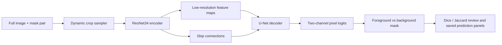
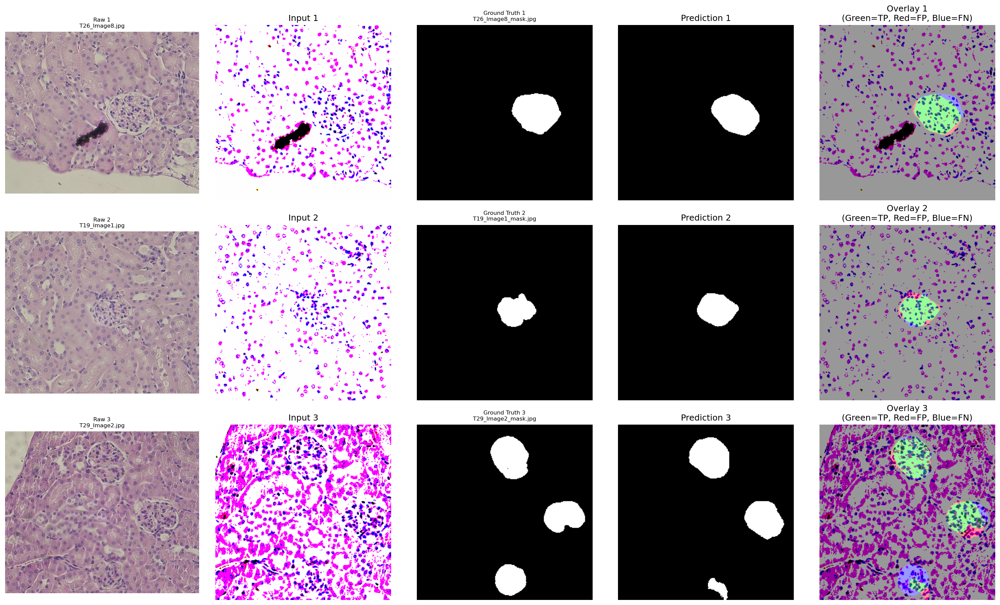
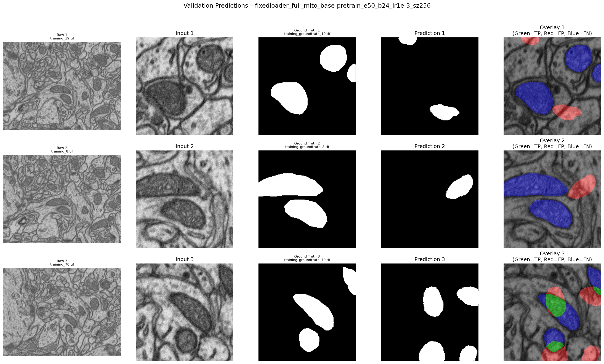
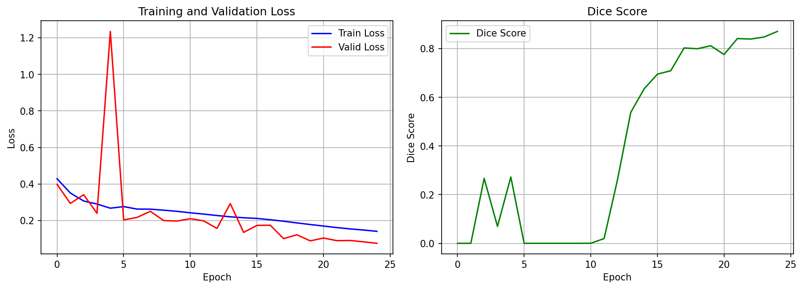
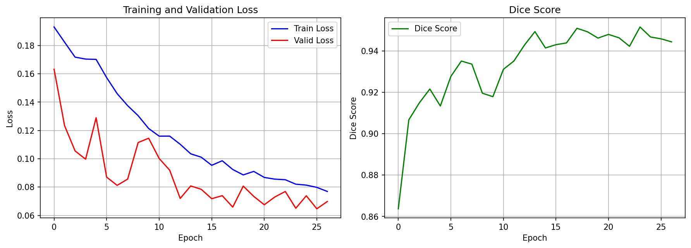
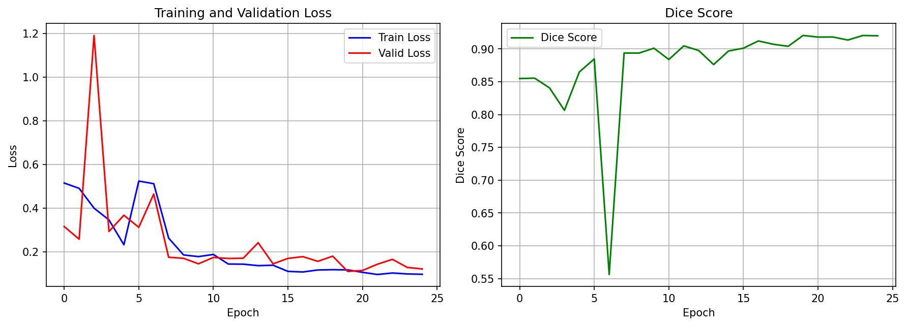

# Technical Lab Notebook: Endotheliosis Quantifier

**Updated**: April 27, 2026  
**Branch**: `master`  
**Project**: Endotheliosis Quantifier (`eq`)  
**Purpose**: Technical status notebook for the checked-in `master` branch

## Scope Note

This notebook describes what the current `master` branch actually implements today.

It is not a project vision document. In particular, it distinguishes between:

- implemented segmentation and data-preparation workflows
- maintained Label Studio-first quantification workflows
- partially implemented or legacy inference code
- local lab-state notes that do not belong in the front-door docs

## Executive Summary

The current `master` branch is best described as a **segmentation-first FastAI/PyTorch codebase** for:

1. mitochondria pretraining on EM-style data
2. glomeruli segmentation in histology images
3. image-level endotheliosis quantification from scored cohorts, with union-ROI crops, frozen segmentation-backbone embeddings, and a burden-index model with comparator outputs
4. supporting utilities for data preparation, metadata processing, mask auditing, visualization, and environment detection

The strongest maintained paths in this branch are the segmentation workflow and the contract-first quantification workflow. Quantification treats image-level grades as supervised targets for image or mask pairs, extracts full multi-component union ROIs, builds frozen segmentation-backbone embeddings, and fits the burden-index estimator in `src/eq/quantification/burden.py` with direct regression and ordinal/multiclass comparator outputs.

The current quantification output is a predictive ordinal stage-burden index with explicit cohort-shape, support, calibration, and uncertainty metadata. The current full-cohort burden result is `exploratory_not_ready`: it is useful for method development and review, but it is not a clinically validated scoring system, not a pixel-level percent endotheliosis measurement, and not a README/docs-ready operational model claim.

## Current Baseline

The current branch baseline matches the main repository docs:

- supported active development environments: WSL/Linux with CUDA-capable PyTorch and macOS Apple Silicon/MPS with the `eq-mac` conda environment
- package source: `src/eq/`
- runtime-heavy raw data, derived data, models, logs, and outputs: the active `EQ_RUNTIME_ROOT`
- repo-local `data/`, `models/`, `logs/`, and `output/`: gitignored placeholders or compatibility locations
- current operational branch: `master`

For the higher-level repo orientation, see:

- [README.md](../README.md)
- [ONBOARDING_GUIDE.md](ONBOARDING_GUIDE.md)
- [OUTPUT_STRUCTURE.md](OUTPUT_STRUCTURE.md)
- [SEGMENTATION_ENGINEERING_GUIDE.md](SEGMENTATION_ENGINEERING_GUIDE.md)

## Repository Layout

The current codebase uses path helpers that prefer the active runtime root for heavy data and artifacts while preserving repo-relative placeholders for portable tests and compatibility:

```text
endotheliosis_quantifier/
├── configs/
├── data/
│   ├── raw_data/
│   └── derived_data/
├── logs/
├── models/
│   └── segmentation/
│       ├── mitochondria/
│       └── glomeruli/
├── output/
├── src/eq/
└── tests/
```

Path defaults are defined in [`src/eq/utils/paths.py`](../src/eq/utils/paths.py):

- raw data: `$EQ_RUNTIME_ROOT/raw_data`
- derived data: `$EQ_RUNTIME_ROOT/derived_data`
- cache: `$EQ_RUNTIME_ROOT/derived_data/cache`
- models: `$EQ_RUNTIME_ROOT/models`
- logs: `$EQ_RUNTIME_ROOT/logs`
- runtime root: `EQ_RUNTIME_ROOT` or the active runtime root selected by `src/eq/utils/paths.py`
- runtime cohort manifest: `$EQ_RUNTIME_ROOT/raw_data/cohorts/manifest.csv`
- runtime outputs: `$EQ_RUNTIME_ROOT/output`
- runtime models: `$EQ_RUNTIME_ROOT/models`

## Problem Framing

The project remains oriented around automated analysis of glomerular histology for endotheliosis-related work, with mitochondria pretraining used as a transfer-learning stage for segmentation.

What the current branch supports directly:

- binary segmentation of mitochondria or glomeruli
- dynamic patching from full images
- metadata standardization for glomeruli scoring spreadsheets
- Label Studio score recovery joined to image/mask pairs
- union-ROI crop extraction from full multi-component masks
- frozen segmentation-backbone embeddings, burden-index predictions, and comparator outputs
- mask-pair auditing and visualization

What it does **not** currently support as a completed, production-ready workflow:

- a clinically validated endotheliosis scoring system
- a clinically or externally validated burden model
- per-glomerulus supervision beyond the available image-level grades
- promoted segmentation artifacts without training-data audit, validation metrics, and non-degenerate prediction review evidence

## Data Model And Input Layouts

The supported segmentation training layout is a full-image root:

```text
<data_root>/
├── images/
└── masks/
```

Full images are loaded directly and crops are sampled during training.

For mitochondria, the installed full-image layout uses separate physical roots:

```text
$EQ_RUNTIME_ROOT/raw_data/mitochondria_data/
├── training/
│   ├── images/
│   └── masks/
└── testing/
    ├── images/
    └── masks/
```

The `training/` root is the training input; the dynamic dataloader creates the train/validation split internally. The `testing/` root is held out for explicit evaluation.

## Local Cohort Manifest Snapshot

This section records the current local lab data state for this checkout. It is intentionally specific to the active runtime data and should be read as a lab notebook snapshot, not as a generic public dataset requirement.

The scored cohort manifest lives at:

```text
$EQ_RUNTIME_ROOT/raw_data/cohorts/manifest.csv
```

The current local manifest state is:

- `lauren_preeclampsia`: 88 current preeclampsia image/mask rows are localized as `manual_mask_core` and `admitted`.
- `vegfri_dox`: 864 Label Studio export rows are represented. The 626 decoded brushlabel image/mask rows include 619 accepted `manual_mask_external` rows used as first-class glomeruli training labels and 7 `unresolved` missing-score rows. The remaining scored-only rows include 228 `foreign` mixed-export rows and 10 unresolved rows without decoded runtime images.
- `vegfri_mr`: 127 workbook image-level rows are represented from the external-drive whole-field TIFF batches. The 126 rows with localized TIFFs are `evaluation_only`; workbook row `8570-5` is unresolved because no matching TIFF was found in the discovered image root. Phase 1 use is concordance/evaluation only.

The Dox runtime surface contains copied images, copied recovered brushlabel masks, copied score exports, and `metadata/decoded_brushlabel_masks.csv` under `raw_data/cohorts/vegfri_dox/`. Dox and Lauren admitted manual-mask rows are co-equal inputs when training from the manifest-backed `raw_data/cohorts` root.

MR is handled as a whole-field TIFF cohort. Manifest rows are image-level, workbook replicates are reduced to a human image-level median, raw replicate vectors are preserved in sidecar ingest artifacts, external-drive source provenance is recorded under `raw_data/cohorts/vegfri_mr/metadata/`, segmentation evaluation belongs under `output/segmentation_evaluation/`, model-generated masks belong under `output/predictions/`, and grading outputs belong under `output/quantification_results/vegfri_mr/`.

MR phase 1 inference has an explicit contract: whole-field TIFF tiling, glomerulus segmentation, component-area filtering, accepted ROI extraction, ROI grading, image-level median aggregation, and human-versus-inferred concordance. Rows with zero accepted inferred ROIs are non-evaluable, not silently admitted.

## Data Preparation Workflow

### Raw Data Validation

The CLI includes a naming validator for raw glomeruli projects:

```bash
eq validate-naming --data-dir "$EQ_RUNTIME_ROOT/raw_data/cohorts/<cohort_id>"
```

### Lucchi Preparation

The Lucchi organizer and image extraction flow still exist:

```bash
eq extract-images \
  --input-dir "$EQ_RUNTIME_ROOT/raw_data/lucchi" \
  --output-dir "$EQ_RUNTIME_ROOT/raw_data/mitochondria_data"
```

### Patchification

The main derived-data builder is:

```bash
eq organize-lucchi \
  --input-dir "$EQ_RUNTIME_ROOT/raw_data/lucchi" \
  --output-dir "$EQ_RUNTIME_ROOT/raw_data/mitochondria_data"
```

Current behavior of `organize-lucchi`:

- creates `training/images`, `training/masks`, `testing/images`, and `testing/masks`
- preserves the physical held-out `testing/` root for explicit evaluation
- produces the mitochondria full-image training root used by the training examples

The checked-in branch does **not** use the older bare repo-root `derived_data/` convention as its primary documentation target.

## Segmentation Architecture

### Neural Network Concept Walkthrough

This section is intentionally conceptual. It explains the maintained segmentation model path.

#### What The Model Is

The maintained segmentation path is a pixel-wise classifier built with FastAI and PyTorch:

- training entrypoints: `src/eq/training/train_mitochondria.py` and `src/eq/training/train_glomeruli.py`
- model builder: `unet_learner(...)`
- encoder backbone: `resnet34`
- output contract: `n_out=2` for background vs foreground segmentation

In practical terms, the network takes an image crop and decides, for each pixel, whether that location belongs to the target structure or to background.

#### How Data Moves Through The Network



The main idea is:

1. the loader starts from full `images/` and `masks/` roots
2. dynamic patching samples crops during training instead of relying on retired static patch datasets
3. the encoder compresses the image into feature maps that retain increasingly abstract spatial patterns
4. the decoder upsamples those features back toward image space
5. skip connections re-introduce fine spatial detail so the model can place boundaries more precisely
6. the final layer emits two scores per pixel, one for background and one for foreground

#### What The Encoder And Decoder Are Doing

- The `resnet34` encoder acts as a feature extractor. Early layers respond to edges, contrast changes, and local texture; deeper layers combine those into larger shape and context patterns.
- The U-Net decoder turns those coarse features back into a dense mask. That matters because segmentation needs location, not just image-level classification.
- Skip connections matter because the deepest features are semantically richer but spatially blurrier. Reusing earlier higher-resolution features helps the model recover structure boundaries.

#### What Training Is Optimizing

The current training scripts construct a binary segmentation learner with:

- `n_out=2`
- FastAI default loss behavior for two-class segmentation
- metrics including `Dice` and `JaccardCoeff()`

Conceptually, each training step does this:

1. sample an image crop and its aligned mask
2. run the crop through the network to produce per-pixel logits
3. compare predicted foreground/background structure against the mask
4. backpropagate the error signal through decoder and encoder weights
5. update parameters so future crops produce masks closer to the training target

#### Why Dynamic Patching Exists

The maintained segmentation loaders use full-image dynamic patching rather than fixed pre-generated patches.

That changes what the network sees during training:

- the model is not locked to one frozen patch export
- positive-aware sampling can revisit sparse target regions more often
- train/validation splits are tracked while still preserving full-image source provenance

In this repo, that behavior is controlled in `src/eq/data_management/datablock_loader.py` through dynamic patching and positive-aware crop settings such as `positive_focus_p`, `min_pos_pixels`, and `pos_crop_attempts`.

#### Current Segmentation Training Snapshot

These checked-in figures come from the April 25, 2026 P0 segmentation workflow artifacts under `$EQ_RUNTIME_ROOT/models/segmentation/` and `$EQ_RUNTIME_ROOT/output/segmentation_evaluation/glomeruli_candidate_comparison/production_glomeruli_candidate_p0_contract_20260425_adjudicated/`. They show repository training outputs and adjudication-aware internal candidate-comparison evidence. They do **not** by themselves establish external validity, scientific readiness, or an unconditional promotion claim.

Current candidate artifacts are identified by the comparison report and model sidecars under the runtime model root.

Current deterministic glomeruli review-panel composition:

- `30` crops across `27` images and `5` subjects
- `10` background crops
- `10` boundary crops
- `10` positive crops

Internal candidate-comparison summary:

| Candidate | Dice | Jaccard | Precision | Recall | Runtime use status | Promotion evidence status |
| --- | ---: | ---: | ---: | ---: | --- | --- |
| `transfer` | `0.8719` | `0.7729` | `0.7957` | `0.9643` | `available_research_use` | `promotion_eligible` |
| `scratch` | `0.8674` | `0.7658` | `0.7975` | `0.9507` | `available_research_use` | `promotion_eligible` |

Current comparison outcome:

- report decision: `insufficient_evidence`
- reason: `transfer_and_scratch_are_within_practical_tie_margin`
- promoted family: `None`
- interpretation: both candidates cleared the adjudication-aware promotion gates, but the comparison does not select a single default because their measured performance is within the configured practical tie margin

Decision-label meaning in this repo:

- `runtime_use_status=available_research_use`: artifact loads and can be used for exploratory development or pipeline smoke testing
- `promotion_evidence_status=audit_missing`: required split, transfer-base, resize, prediction-shape, or documentation evidence is missing
- `promotion_evidence_status=not_promotion_eligible`: evidence is present but fails one or more promotion gates
- `promotion_evidence_status=insufficient_evidence_for_promotion`: evidence is not structurally invalid, but it is not enough to support a promoted default or README-facing performance claim
- `promotion_evidence_status=promotion_eligible`: held-out audit evidence clears the required gates

These panels are useful because they make the task concrete: the network is not producing one global score first. It is producing a spatial mask, and those masks are then visually compared against held-out targets.

##### Current Validation Examples

The glomeruli panels below are generated by `src/eq/training/compare_glomeruli_candidates.py` from the deterministic candidate-comparison manifest, not from the first arbitrary training validation batch. They use the same adjudicated comparison crops, threshold (`0.75`), resize order, and prediction rows used by the promotion gates. Each row shows the raw source image with the selected crop boxed, the resized model input, the ground truth overlay, the prediction overlay, and the TP/FP/FN overlay. Each panel includes one selected background, boundary, and positive example; background uses the minimum predicted foreground fraction, and boundary/positive examples use the best Dice/Jaccard rows within category. The error overlay uses green for true positive, red for false positive, and blue for false negative.

Current glomeruli transfer candidate:


Current glomeruli no-mitochondria-base candidate:



Current mitochondria base held-out testing examples:



##### Current Metric Curves

Current mitochondria base metric history:



Current glomeruli transfer candidate metric history:



Current glomeruli no-mitochondria-base candidate metric history:



The metric curves and prediction panels illustrate optimization progress and internal validation behavior, not scientific validity. A smoother loss curve or higher overlap on this deterministic panel can still correspond to leakage, label issues, or poor transportability, which is why the repo keeps promotion and audit language separate from simple training completion.

#### What The Pictures Support And What They Do Not

What they support directly:

- the code is training a segmentation network rather than a pure image-level classifier
- the network emits spatial predictions that can be visually inspected
- the training stack saves review artifacts that expose optimization behavior and example masks

What they do not support on their own:

- that the model learned the intended biological signal
- that the model is robust across sites, stains, scanners, or cohorts
- that high overlap on a small validation split is clinically meaningful
- that an exported artifact is eligible for promotion without the required audit evidence

#### Transfer Learning In This Repo

The two-stage conceptual story in this codebase is:

1. train a mitochondria segmentation model from an ImageNet-initialized ResNet34 encoder
2. reuse that learned representation as the starting point for glomeruli training

The intuition is that the encoder may already have useful low-level and mid-level visual features from mitochondria training, so glomeruli training does not start from only the generic ImageNet baseline. That is an implementation choice and an efficiency hypothesis. It still needs empirical comparison against a no-mitochondria-base ImageNet baseline, which is why the repo has explicit candidate-comparison and promotion-gate surfaces instead of assuming transfer is automatically better.

### Core Contract

The current branch follows a consistent binary segmentation contract:

- class `0`: background
- class `1`: foreground
- `n_out=2`
- masks normalized to `0/1`
- FastAI default loss selection retained for this output format

This aligns with the engineering guidance in [SEGMENTATION_ENGINEERING_GUIDE.md](SEGMENTATION_ENGINEERING_GUIDE.md).

### Model Choice

Current training code uses:

- FastAI v2 with PyTorch
- `unet_learner(...)`
- `resnet34` encoder backbone
- metrics including `Dice` and `JaccardCoeff()`

### Transform Pipeline

The current loader behavior is:

- `item_tfms`: primarily resize/geometry placement
- `batch_tfms`: `IntToFloatTensor()`, augmentation, ImageNet normalization, and mask preprocessing

This matters because the older documentation pattern that put `aug_transforms(...)` in `item_tfms` is no longer the branch truth.

## Training Strategy

### Stage 1: Mitochondria Pretraining

Primary entrypoint:

```bash
python -m eq.training.train_mitochondria \
  --data-dir "$EQ_RUNTIME_ROOT/raw_data/mitochondria_data/training" \
  --model-dir "$EQ_RUNTIME_ROOT/models/segmentation/mitochondria" \
  --epochs 50 \
  --batch-size 24 \
  --learning-rate 1e-3 \
  --image-size 256
```

Current defaults in the training module:

- epochs: `50`
- batch size: machine-aware; currently `24` on the powerful Apple Silicon MPS machine class when using `256x256` crops
- learning rate: `1e-3`
- image size: `256`
- training mode: `dynamic_full_image_patching`

### Stage 2: Glomeruli Training

Primary entrypoint:

```bash
python -m eq.training.train_glomeruli \
  --data-dir /absolute/path/to/raw_data/cohorts \
  --model-dir /absolute/path/to/glomeruli_models \
  --base-model /absolute/path/to/mito_supported_base.pkl \
  --epochs 30 \
  --batch-size 12 \
  --learning-rate 1e-3 \
  --image-size 256 \
  --crop-size 512 \
  --seed 42
```

For all-data glomeruli training, use the manifest-backed `raw_data/cohorts` registry root. It trains from admitted manifest rows in the `manual_mask_core` and `manual_mask_external` lanes. For a single-cohort run, use the localized cohort root `raw_data/cohorts/<cohort_id>`. Raw backup trees are source material, not direct training roots. Generated manifests, audits, caches, and metrics belong under `derived_data` or `output`.

Important nuance:

- the README YAML-first workflow is the recommended workflow documentation
- the `train_glomeruli.py` module resolves a machine-aware default batch size and currently starts at `12` on the powerful Apple Silicon MPS machine class when using `512x512` crops
- `eq run-config --config configs/glomeruli_candidate_comparison.yaml` is the normal candidate-comparison control surface
- transfer training with `--base-model` must load that artifact and copy compatible weights; `--from-scratch` means no mitochondria/base artifact and currently uses an ImageNet-pretrained ResNet34 encoder
- the direct training module CLI remains useful for targeted runs outside the full YAML workflow

### Dynamic Patching

Dynamic patching is a real current feature, not just a future idea.

The checked-in loader stack supports:

- loading full images from `images/`
- resolving masks from `masks/`
- on-the-fly crops
- positive-aware cropping for sparse targets

Key positive-aware cropping controls:

- `positive_focus_p`
- `min_pos_pixels`
- `pos_crop_attempts`

## Data Validation And Loader Behavior

Current loader behavior is stricter than the older notebook described.

Implemented validation includes:

- early image-mask pairing checks for full-image dynamic training roots
- failure when expected masks are missing
- basic sampled mask-content sanity checks on validation items
- rejection of retired static patch roots before model construction

This is one of the more mature parts of the current branch.

## Output Structure

### Training Artifacts

The current training scripts create per-run folders under the model directory.

Typical mitochondria pattern:

```text
models/segmentation/mitochondria/
└── <model_name>-pretrain_e<epochs>_b<batch>_lr<lr>_sz<size>/
```

Typical glomeruli pattern:

```text
models/segmentation/glomeruli/
├── transfer/
│   └── <model_name>-transfer_e<epochs>_b<batch>_lr<lr>_sz<size>/
└── scratch/
    └── <model_name>-scratch_e<epochs>_b<batch>_lr<lr>_sz<size>/
```

Current artifact filenames are prefixed by the run folder name, for example:

- `<model>_training_loss.png`
- `<model>_lr_schedule.png`
- `<model>_metrics.png`
- `<model>_validation_predictions.png`
- `<model>_training_history.tsv`
- `<model>_splits.json`
- `<model>_run_metadata.txt`

The per-model `<model>_validation_predictions.png` file is a training diagnostic. Front-facing glomeruli validation examples come from the deterministic candidate-comparison report under `output/segmentation_evaluation/glomeruli_candidate_comparison/<run_id>/review_assets/<family>_validation_predictions.png`. Front-facing mitochondria examples come from the held-out physical testing root and are generated under `output/segmentation_evaluation/mitochondria_validation_examples/<run_id>/`.

### General Output Manager

Separate from training-artifact folders, the repository also has an `OutputManager` that creates:

```text
output/<data_source>/
├── models/
├── plots/
├── results/
└── cache/
```

## Metadata And Spreadsheet Processing

Metadata processing is implemented and useful today.

The current metadata processor can:

- read glomeruli scoring matrices from Excel
- clean summary rows and unnamed columns
- convert wide subject-by-column data into long format
- produce standardized columns:
  - `subject_id`
  - `glomerulus_id`
  - `score`
- create subject summaries
- run metadata-quality validation

Primary CLI entrypoint:

```bash
eq metadata-process \
  --input-file "$EQ_RUNTIME_ROOT/raw_data/cohorts/<cohort_id>/metadata/subject_metadata.xlsx" \
  --output-dir "$EQ_RUNTIME_ROOT/derived_data/<project>/metadata"
```

## Quantification Status

### What Exists

The current `master` branch contains a maintained quantification path under [`src/eq/quantification/pipeline.py`](../src/eq/quantification/pipeline.py) plus supporting contract and score-recovery utilities.

What exists today:

- Label Studio-first score recovery from image-level annotation exports
- explicit duplicate-annotation reconciliation with audit outputs
- image-level scored-example tables joined to raw image/mask pairs
- manifest-owned `subject_id`, `sample_id`, and `image_id` identity for quantification
- six-bin score support for `[0.0, 0.5, 1.0, 1.5, 2.0, 3.0]`
- union-ROI extraction over the full multi-component mask
- frozen segmentation-encoder embedding extraction
- grouped cumulative-threshold burden-index prediction
- direct stage-index regression and ordinal/multiclass comparator outputs
- prediction exports with threshold probabilities, burden index, prediction sets, uncertainty intervals, nearest scored examples, and comparator probabilities
- a combined HTML review artifact with selected example cases, cohort summaries, threshold support, and claim-boundary text
- candidate-screen artifacts including `signal_comparator_metrics.csv`, `subject_level_candidate_predictions.csv`, and `precision_candidate_summary.json`; these are not deployed models
- morphology-aware feature artifacts for open/pale lumina, collapsed or slit-like structures, ridge/line responses, erythrocyte-like patent-lumen confounding, ROI quality, visual feature review, and operator adjudication
- the older openness heuristic in [`src/eq/evaluation/quantification_metrics.py`](../src/eq/evaluation/quantification_metrics.py), best treated as an audit feature rather than the primary learned model

### What Does Not Yet Exist As A Matured Workflow

The current `master` branch still does **not** provide:

- per-glomerulus labels inside multi-glomerulus images
- validated subject-level endotheliosis burden prediction as the primary shareable target
- a fully production-hardened deployment path from predicted masks to final score
- faithful attribution methods for the embedding model

The maintained quantification CLI surface is `prepare-quant-contract` plus `quant-endo`.

## Inference Status

Inference support is scoped.

### Present In The Repo

The branch includes:

- the shared prediction core
- GPU glomeruli inference

### Caveat

This code should be treated as a model-facing inference surface, not a fully trusted production quantification workflow.

Reasons:

- promotion and comparison gates still need explicit candidate artifacts and validation manifests
- end-to-end image-level quantification is maintained through `prepare-quant-contract` and `quant-endo`

So inference modules should not be interpreted as proof of a complete production deployment path.

## Recommended Entry Points On `master`

For the current branch, the safest supported workflow is:

1. validate raw naming with `eq validate-naming`
2. prepare full-image extracted data with `eq extract-images`
3. export Label Studio PNG masks plus annotation JSON when image-level quantification labels are needed
4. process metadata with `eq metadata-process` if spreadsheets are present for audit context
5. run `eq prepare-quant-contract` to recover score-linked image/mask pairs
6. run `eq quant-endo` for the current embedding-first burden-index model and comparator outputs
7. train mitochondria via `python -m eq.training.train_mitochondria`
8. train glomeruli via `python -m eq.training.train_glomeruli`

Use the dedicated training modules for heavy model training.

## Current Known Gaps

As of April 26, 2026 on `master`, the main known gaps are:

- the maintained learned quantification path includes morphology-aware candidate features, but those features still require operator review and refreshed readiness evidence before becoming a shareable subject/cohort burden claim
- uncertainty outputs must be interpreted through the generated calibration and prediction-set artifacts; the current full-cohort run undercovers the nominal 0.90 prediction-set target and has broad average prediction sets
- backend matrix-operation warnings remain recorded for several candidate screens, although outputs are finite
- candidate screens are review artifacts, not deployed models
- interpretation in the HTML review report is predictive support evidence rather than attribution-faithful mechanism
- inference exists but is not uniformly current
- some configs, README examples, and code defaults still disagree on exact training hyperparameters

## Current Status

The current `master` branch should be described as:

**A maintained segmentation repository with useful data-preparation utilities, an exploratory image-level learned quantification workflow across scored cohorts, deterministic morphology-aware feature screens, partial inference code, and remaining scientific or production gaps around calibration, deployment, validated morphology interpretation, and per-glomerulus labeling.**

This baseline is useful for predictive audit work, but it is not a finished clinically trustworthy scoring system.
