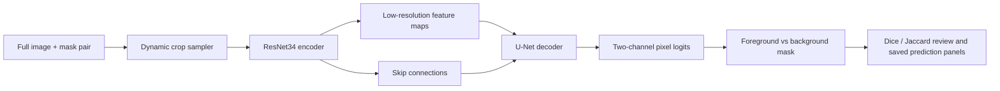

# Technical Lab Notebook: Endotheliosis Quantifier

**Updated**: April 23, 2026  
**Branch**: `master`  
**Project**: Endotheliosis Quantifier (`eq`)  
**Purpose**: Technical status notebook for the checked-in `master` branch

## Scope Note

This notebook describes what the current `master` branch actually implements today.

It is not a project vision document. In particular, it distinguishes between:

- implemented segmentation and data-preparation workflows
- maintained Label Studio-first quantification workflows
- partially implemented or legacy inference code

## Executive Summary

The current `master` branch is best described as a **segmentation-first FastAI/PyTorch codebase** for:

1. mitochondria pretraining on EM-style data
2. glomeruli segmentation in histology images
3. Label Studio-derived image-level endotheliosis scoring with union-ROI crops, frozen segmentation-backbone embeddings, and an ordinal baseline
4. supporting utilities for data preparation, metadata processing, mask auditing, visualization, and environment detection

The strongest maintained paths in this branch are the segmentation workflow and the contract-first quantification baseline. The quantification baseline treats Label Studio image-level grades as supervised targets for image/mask pairs, extracts full multi-component union ROIs, builds frozen segmentation-backbone embeddings, and fits the canonical penalized multiclass ordinal estimator in `src/eq/quantification/ordinal.py`.

The current quantification output is a predictive audit baseline with explicit cohort-shape metadata. It is not a clinically validated scoring system, and its current local audit cohort does not yet provide full seven-bin target support.

## Current Baseline

The current branch baseline matches the main repository docs:

- primary development target: WSL on Windows with CUDA-capable PyTorch
- macOS local-development target: Apple Silicon/MPS with the `eq-mac` conda environment
- package source: `src/eq/`
- runtime-heavy raw data, derived data, models, logs, and outputs: the active `EQ_RUNTIME_ROOT`
- repo-local `data/`, `models/`, `logs/`, and `output/`: gitignored placeholders or compatibility locations
- current operational branch: `master`

For the higher-level repo orientation, see:

- [README.md](../README.md)
- [ONBOARDING_GUIDE.md](ONBOARDING_GUIDE.md)
- [OUTPUT_STRUCTURE.md](OUTPUT_STRUCTURE.md)
- [SEGMENTATION_ENGINEERING_GUIDE.md](SEGMENTATION_ENGINEERING_GUIDE.md)

## Repository Layout

The current codebase uses path helpers that prefer the active runtime root for heavy data and artifacts while preserving repo-relative placeholders for portable tests and compatibility:

```text
endotheliosis_quantifier/
├── configs/
├── data/
│   ├── raw_data/
│   └── derived_data/
├── logs/
├── models/
│   └── segmentation/
│       ├── mitochondria/
│       └── glomeruli/
├── output/
├── src/eq/
└── tests/
```

Path defaults are defined in [`src/eq/utils/paths.py`](../src/eq/utils/paths.py):

- raw data: `data/raw_data`
- derived data: `data/derived_data`
- cache: `data/derived_data/cache`
- models: `models`
- logs: `logs`
- runtime root: `EQ_RUNTIME_ROOT` or the active runtime root selected by `src/eq/utils/paths.py`
- runtime cohort manifest: `$EQ_RUNTIME_ROOT/raw_data/cohorts/manifest.csv`
- runtime outputs: `$EQ_RUNTIME_ROOT/output`
- runtime models: `$EQ_RUNTIME_ROOT/models`

## Problem Framing

The project remains oriented around automated analysis of glomerular histology for endotheliosis-related work, with mitochondria pretraining used as a transfer-learning stage for segmentation.

What the current branch supports directly:

- binary segmentation of mitochondria or glomeruli
- dynamic patching from full images
- metadata standardization for glomeruli scoring spreadsheets
- Label Studio score recovery joined to image/mask pairs
- union-ROI crop extraction from full multi-component masks
- frozen segmentation-backbone embeddings and ordinal image-level predictions
- mask-pair auditing and visualization

What it does **not** currently support as a completed, production-ready workflow:

- a clinically validated endotheliosis scoring system
- full seven-bin target-support validation in the current local audit cohort
- per-glomerulus supervision beyond the available image-level grades
- promoted segmentation artifacts without training-data audit, validation metrics, and non-degenerate prediction review evidence

## Data Model And Input Layouts

The supported segmentation training layout is a full-image root:

```text
<data_root>/
├── images/
└── masks/
```

Full images are loaded directly and crops are sampled during training.

For mitochondria, the installed full-image layout uses separate physical roots:

```text
data/derived_data/mitochondria_data/
├── training/
│   ├── images/
│   └── masks/
└── testing/
    ├── images/
    └── masks/
```

The `training/` root is the training input; the dynamic dataloader creates the train/validation split internally. The `testing/` root is held out for explicit evaluation.

## Data Preparation Workflow

### Raw Data Validation

The CLI includes a naming validator for raw glomeruli projects:

```bash
eq validate-naming --data-dir data/raw_data/<your_project>
```

### Lucchi Preparation

The Lucchi organizer and image extraction flow still exist:

```bash
eq extract-images \
  --input-dir data/raw_data/lucchi \
  --output-dir data/derived_data/mito
```

### Patchification

The main derived-data builder is:

```bash
eq organize-lucchi \
  --input-dir data/raw_data/lucchi \
  --output-dir data/derived_data/mitochondria_data
```

Current behavior of `organize-lucchi`:

- creates `training/images`, `training/masks`, `testing/images`, and `testing/masks`
- preserves the physical held-out `testing/` root for explicit evaluation
- produces the mitochondria full-image training root used by the training examples

The checked-in branch does **not** use the older bare repo-root `derived_data/` convention as its primary documentation target.

## Segmentation Architecture

### Neural Network Concept Walkthrough

This section is intentionally conceptual. It explains the maintained segmentation model path.

#### What The Model Is

The maintained segmentation path is a pixel-wise classifier built with FastAI and PyTorch:

- training entrypoints: `src/eq/training/train_mitochondria.py` and `src/eq/training/train_glomeruli.py`
- model builder: `unet_learner(...)`
- encoder backbone: `resnet34`
- output contract: `n_out=2` for background vs foreground segmentation

In practical terms, the network takes an image crop and decides, for each pixel, whether that location belongs to the target structure or to background.

#### How Data Moves Through The Network



The main idea is:

1. the loader starts from full `images/` and `masks/` roots
2. dynamic patching samples crops during training instead of relying on retired static patch datasets
3. the encoder compresses the image into feature maps that retain increasingly abstract spatial patterns
4. the decoder upsamples those features back toward image space
5. skip connections re-introduce fine spatial detail so the model can place boundaries more precisely
6. the final layer emits two scores per pixel, one for background and one for foreground

#### What The Encoder And Decoder Are Doing

- The `resnet34` encoder acts as a feature extractor. Early layers respond to edges, contrast changes, and local texture; deeper layers combine those into larger shape and context patterns.
- The U-Net decoder turns those coarse features back into a dense mask. That matters because segmentation needs location, not just image-level classification.
- Skip connections matter because the deepest features are semantically richer but spatially blurrier. Reusing earlier higher-resolution features helps the model recover structure boundaries.

#### What Training Is Optimizing

The current training scripts construct a binary segmentation learner with:

- `n_out=2`
- FastAI default loss behavior for two-class segmentation
- metrics including `Dice` and `JaccardCoeff()`

Conceptually, each training step does this:

1. sample an image crop and its aligned mask
2. run the crop through the network to produce per-pixel logits
3. compare predicted foreground/background structure against the mask
4. backpropagate the error signal through decoder and encoder weights
5. update parameters so future crops produce masks closer to the training target

#### Why Dynamic Patching Exists

The maintained segmentation loaders use full-image dynamic patching rather than fixed pre-generated patches.

That changes what the network sees during training:

- the model is not locked to one frozen patch export
- positive-aware sampling can revisit sparse target regions more often
- train/validation splits are tracked while still preserving full-image source provenance

In this repo, that behavior is controlled in `src/eq/data_management/datablock_loader.py` through dynamic patching and positive-aware crop settings such as `positive_focus_p`, `min_pos_pixels`, and `pos_crop_attempts`.

#### Concept Images

These images are included to illustrate the concept of the maintained segmentation workflow. They show examples of training outputs and validation predictions from this repository. They do **not** by themselves establish that a model is scientifically valid, generalizable, or promoted for use.

##### Example Validation Predictions

Mitochondria example:


Glomeruli transfer-learning example:


These panels are useful because they make the task concrete: the network is not producing one global score first. It is producing a spatial mask, and those masks are then visually compared against held-out targets.

##### Example Training Curves

Mitochondria training-loss example:


Glomeruli transfer training-loss example:


These curves illustrate optimization progress, not scientific validity. A smoother or lower loss curve can still correspond to leakage, bad labels, missing negatives, or degenerate predictions, which is why the repo keeps promotion and audit language separate from simple training completion.

#### What The Pictures Support And What They Do Not

What they support directly:

- the code is training a segmentation network rather than a pure image-level classifier
- the network emits spatial predictions that can be visually inspected
- the training stack saves review artifacts that expose optimization behavior and example masks

What they do not support on their own:

- that the model learned the intended biological signal
- that the model is robust across sites, stains, scanners, or cohorts
- that high overlap on a small validation split is clinically meaningful
- that an exported artifact is eligible for promotion without the required audit evidence

#### Transfer Learning In This Repo

The two-stage conceptual story in this codebase is:

1. train a mitochondria segmentation model from an ImageNet-initialized ResNet34 encoder
2. reuse that learned representation as the starting point for glomeruli training

The intuition is that the encoder may already have useful low-level and mid-level visual features from mitochondria training, so glomeruli training does not start from only the generic ImageNet baseline. That is an implementation choice and an efficiency hypothesis. It still needs empirical comparison against a no-mitochondria-base ImageNet baseline, which is why the repo has explicit candidate-comparison and promotion-gate surfaces instead of assuming transfer is automatically better.

### Core Contract

The current branch follows a consistent binary segmentation contract:

- class `0`: background
- class `1`: foreground
- `n_out=2`
- masks normalized to `0/1`
- FastAI default loss selection retained for this output format

This aligns with the engineering guidance in [SEGMENTATION_ENGINEERING_GUIDE.md](SEGMENTATION_ENGINEERING_GUIDE.md).

### Model Choice

Current training code uses:

- FastAI v2 with PyTorch
- `unet_learner(...)`
- `resnet34` encoder backbone
- metrics including `Dice` and `JaccardCoeff()`

### Transform Pipeline

The current loader behavior is:

- `item_tfms`: primarily resize/geometry placement
- `batch_tfms`: `IntToFloatTensor()`, augmentation, ImageNet normalization, and mask preprocessing

This matters because the older documentation pattern that put `aug_transforms(...)` in `item_tfms` is no longer the branch truth.

## Training Strategy

### Stage 1: Mitochondria Pretraining

Primary entrypoint:

```bash
python -m eq.training.train_mitochondria \
  --data-dir data/derived_data/mitochondria_data/training \
  --model-dir models/segmentation/mitochondria \
  --epochs 50 \
  --batch-size 24 \
  --learning-rate 1e-3 \
  --image-size 256
```

Current defaults in the training module:

- epochs: `50`
- batch size: machine-aware; currently `24` on the powerful Apple Silicon MPS machine class when using `256x256` crops
- learning rate: `1e-3`
- image size: `256`
- training mode: `dynamic_full_image_patching`

### Stage 2: Glomeruli Training

Primary entrypoint:

```bash
python -m eq.training.train_glomeruli \
  --data-dir /absolute/path/to/raw_data/cohorts \
  --model-dir /absolute/path/to/glomeruli_models \
  --base-model /absolute/path/to/mito_supported_base.pkl \
  --epochs 30 \
  --batch-size 12 \
  --learning-rate 1e-3 \
  --image-size 256 \
  --crop-size 512 \
  --seed 42
```

For all-data glomeruli training, use the manifest-backed `raw_data/cohorts` registry root. It trains from admitted manifest rows in the `manual_mask` and `masked_external` lanes. A single active paired project root such as `raw_data/preeclampsia_project/data` remains valid for project-only training. Raw project backups are source material, not direct training roots. Generated manifests, audits, caches, and metrics belong under `derived_data` or `output`.

Important nuance:

- the README example above is the recommended workflow documentation
- the `train_glomeruli.py` module resolves a machine-aware default batch size and currently starts at `12` on the powerful Apple Silicon MPS machine class when using `512x512` crops
- the canonical control surface is the dedicated training module CLI with explicit `--base-model` or `--from-scratch`
- transfer training with `--base-model` must load that artifact and copy compatible weights; `--from-scratch` means no mitochondria/base artifact and currently uses an ImageNet-pretrained ResNet34 encoder
- `configs/glomeruli_finetuning_config.yaml` is an optional overlay and engineering reference, not the authoritative promotion-workflow contract

So the notebook should describe the explicit CLI path as canonical and treat YAML only as optional overlay material.

### Dynamic Patching

Dynamic patching is a real current feature, not just a future idea.

The checked-in loader stack supports:

- loading full images from `images/`
- resolving masks from `masks/`
- on-the-fly crops
- positive-aware cropping for sparse targets

Key positive-aware cropping controls:

- `positive_focus_p`
- `min_pos_pixels`
- `pos_crop_attempts`

## Data Validation And Loader Behavior

Current loader behavior is stricter than the older notebook described.

Implemented validation includes:

- early image-mask pairing checks for full-image dynamic training roots
- failure when expected masks are missing
- basic sampled mask-content sanity checks on validation items
- static patch loaders retained only for legacy audit/conversion inspection

This is one of the more mature parts of the current branch.

## Output Structure

### Training Artifacts

The current training scripts create per-run folders under the model directory.

Typical mitochondria pattern:

```text
models/segmentation/mitochondria/
└── <model_name>-pretrain_e<epochs>_b<batch>_lr<lr>_sz<size>/
```

Typical glomeruli pattern:

```text
models/segmentation/glomeruli/
├── transfer/
│   └── <model_name>-transfer_e<epochs>_b<batch>_lr<lr>_sz<size>/
└── scratch/
    └── <model_name>-scratch_e<epochs>_b<batch>_lr<lr>_sz<size>/
```

Current artifact filenames are prefixed by the run folder name, for example:

- `<model>_training_loss.png`
- `<model>_lr_schedule.png`
- `<model>_metrics.png`
- `<model>_validation_predictions.png`
- `<model>_training_history.tsv`
- `<model>_splits.json`
- `<model>_run_metadata.txt`

### General Output Manager

Separate from training-artifact folders, the repository also has an `OutputManager` that creates:

```text
output/<data_source>/
├── models/
├── plots/
├── results/
└── cache/
```

This path is used by the older production pipeline code.

## Metadata And Spreadsheet Processing

Metadata processing is implemented and useful today.

The current metadata processor can:

- read glomeruli scoring matrices from Excel
- clean summary rows and unnamed columns
- convert wide subject-by-column data into long format
- produce standardized columns:
  - `subject_id`
  - `glomerulus_id`
  - `score`
- create subject summaries
- run metadata-quality validation

Primary CLI entrypoint:

```bash
eq metadata-process \
  --input-file data/raw_data/<project>/subject_metadata.xlsx \
  --output-dir data/derived_data/<project>/metadata
```

## Quantification Status

### What Exists

The current `master` branch now contains a maintained baseline quantification path under [`src/eq/quantification/pipeline.py`](../src/eq/quantification/pipeline.py) plus supporting contract and score-recovery utilities.

What exists today:

- Label Studio-first score recovery from image-level annotation exports
- explicit duplicate-annotation reconciliation with audit outputs
- image-level scored-example tables joined to raw image/mask pairs
- union-ROI extraction over the full multi-component mask
- frozen segmentation-encoder embedding extraction
- grouped ordinal image-level endotheliosis prediction
- prediction exports with class probabilities, expected score, top-two margin, and entropy
- an HTML review artifact with selected example cases
- the older openness heuristic in [`src/eq/evaluation/quantification_metrics.py`](../src/eq/evaluation/quantification_metrics.py), now best treated as an audit feature rather than the primary learned model

### What Does Not Yet Exist As A Matured Workflow

The current `master` branch still does **not** provide:

- calibrated uncertainty estimates
- per-glomerulus labels inside multi-glomerulus images
- validated subject-level endotheliosis prediction as the primary target
- a fully production-hardened deployment path from predicted masks to final score
- faithful attribution methods for the embedding model

The CLI commands `extract-features` and `quantify` still print that they are not yet implemented, so the maintained quantification surface is currently `prepare-quant-contract` plus `quant-endo`.

## Inference Status

Inference support is mixed.

### Present In The Repo

The branch includes:

- glomeruli inference modules
- mitochondria inference modules
- a production-pipeline module intended to load existing models and generate outputs

### Caveat

This code should be treated as **partially maintained** rather than a fully trusted production surface.

Reasons:

- some inference paths still reference older assumptions
- some modules import code that is not present in the tracked source tree
- the production pipeline contains legacy dependencies and undefined classes

So the presence of inference files should not be interpreted as proof of a clean end-to-end supported workflow.

## Recommended Entry Points On `master`

For the current branch, the safest supported workflow is:

1. validate raw naming with `eq validate-naming`
2. prepare derived data with `eq extract-images` or `eq process-data`
3. export Label Studio PNG masks plus annotation JSON when image-level quantification labels are needed
4. process metadata with `eq metadata-process` if spreadsheets are present for legacy support or audit context
5. run `eq prepare-quant-contract` to recover score-linked image/mask pairs
6. run `eq quant-endo` for the current embedding-first image-level baseline
7. audit masks with `eq audit-derived`
8. train mitochondria via `python -m eq.training.train_mitochondria`
9. train glomeruli via `python -m eq.training.train_glomeruli`

Use the dedicated training modules for heavy model training.

## Current Known Gaps

As of April 2, 2026 on `master`, the main known gaps are:

- the maintained learned quantification path is still an image-level baseline rather than a biologically explicit per-glomerulus model
- uncertainty outputs are confidence proxies, not calibrated probabilities
- interpretation in the HTML review report is descriptive rather than attribution-faithful
- inference exists but is not uniformly current
- some configs, README examples, and code defaults still disagree on exact training hyperparameters

## Current Status

The current `master` branch should be described as:

**A maintained segmentation repository with useful data-preparation utilities, a working Label Studio-first image-level learned quantification baseline, partial inference code, and remaining scientific/production gaps around calibration, deployment, and per-glomerulus labeling.**

This baseline is useful for predictive audit work, but it is not a finished clinically trustworthy scoring system.
